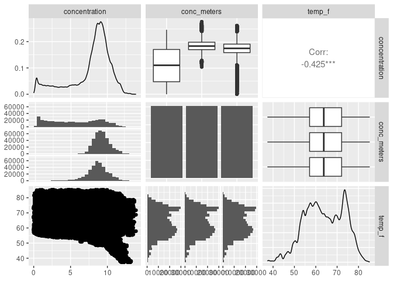

Activity 3 - MLR
================

``` r
# Get sheet names
lake_sheets <- excel_sheets("~/STA631/Activities/activity03-mlr/data/buoy-2011-2020.xlsx")  

# Read all sheets to list
list_all <- lapply(lake_sheets, function(x) {       
  as.data.frame(read_excel("~/STA631/Activities/activity03-mlr/data/buoy-2011-2020.xlsx", 
                           sheet = x))})

# New names for sheets that follow R naming conventions
new_names <- c("meteor", "h20_tempf", "h20_tempc", "dissolved_02", 
               "depth", "chl_phyco", "notes")

# Rename list elements in list_all with new_names
names(list_all) <- new_names

# Extract list elements to Global Environment
list2env(list_all, envir = .GlobalEnv)
```

    ## <environment: R_GlobalEnv>

``` r
# Change names

chl_phyco_names <- c("dates", "chlor", "phyco")
names(chl_phyco) <- chl_phyco_names

depth_names <- c("dates", "depth_2m", "depth_5m", "depth_8m", "depth_11m")
names(depth) <- depth_names

dissolved_02_names <- c("dates", "sat_2m", "conc_2m", "sat_5m", "conc_5m",
  "sat_8m", "conc_8m", "sat_11m", "conc_11m")
names(dissolved_02) <- dissolved_02_names

h20_tempf_names <- c("dates", "tnode_1.7m", "temp_2m", "tnode_4m", "temp_5m", 
  "tnode_6m", "tnode_8m", "tnode_10m", "temp_11m")
names(h20_tempf) <- h20_tempf_names

meteor_names <- c("dates", "air_temp_f", "humidity", "barom", "wind_speed",
  "max_wind_speed", "wind_direct", "rain_intensity", "tot_rain",  "annual_rain_accum", "inter_rain")
names(meteor) <- meteor_names
```

``` r
lake_data <- dissolved_02 %>% inner_join(h20_tempf, by = "dates")

lake_data <- lake_data %>% inner_join(meteor, by = "dates")
```

1.  Is this an observational study or an experiment?

**Answer:** This study is observational.

2.  Describe the distribution of your response variable. Is the
    distribution skewed? Are there any other interesting/odd features
    (outliers, multiple peaks, etc.)? Is this what you expected to see?
    Why, or why not?

**Answer:** The distribution of my response variable `concentration` is
skewed to the left. Noteworthy is that there appears to be a slight
u-shape in that left tail. There is no temp reading at 8 meters in this
dataset so I did not include the corresponding 8m concentration
readings, so that could have something to do with it.

3.  Excluding your response variable, select two other numeric variables
    (hint: look for <dbl> or <int> designations) and describe their
    relationship with each other using an appropriate visualization.

**Answer:** Are we choosing chlor or phyco? I have no idea what is going
on in these scatterplots lol.

``` r
lake_data <- lake_data %>% 
  pivot_longer(c(conc_2m, conc_5m, conc_11m), names_to = "conc_meters", 
               values_to = "concentration") %>% 
  pivot_longer(c(temp_2m, temp_5m, temp_11m), names_to = "temp_meters", 
               values_to = "temp_f") %>% 
  select(-c(conc_8m, sat_2m, sat_5m, sat_8m, sat_11m, tnode_1.7m, tnode_4m, tnode_6m, tnode_8m, tnode_10m))
```

``` r
ggplot(lake_data) +
  geom_histogram(aes(x = concentration))
```

    ## `stat_bin()` using `bins = 30`. Pick better value with `binwidth`.

    ## Warning: Removed 72525 rows containing non-finite values (`stat_bin()`).

<!-- -->

``` r
ggplot(lake_data) +
  geom_point(aes(x = temp_f, y = wind_speed))
```

    ## Warning: Removed 5982 rows containing missing values (`geom_point()`).

<!-- -->

``` r
lake_data %>% 
  select(concentration, temp_f, wind_speed) %>% 
  ggpairs()
```

    ## Warning: Removed 72525 rows containing non-finite values (`stat_density()`).

    ## Warning in ggally_statistic(data = data, mapping = mapping, na.rm = na.rm, :
    ## Removed 73757 rows containing missing values

    ## Warning in ggally_statistic(data = data, mapping = mapping, na.rm = na.rm, :
    ## Removed 75843 rows containing missing values

    ## Warning: Removed 73757 rows containing missing values (`geom_point()`).

    ## Warning: Removed 2661 rows containing non-finite values (`stat_density()`).

    ## Warning in ggally_statistic(data = data, mapping = mapping, na.rm = na.rm, :
    ## Removed 5982 rows containing missing values

    ## Warning: Removed 75843 rows containing missing values (`geom_point()`).

    ## Warning: Removed 5982 rows containing missing values (`geom_point()`).

    ## Warning: Removed 3321 rows containing non-finite values (`stat_density()`).

<!-- -->

4.  For each pair of variables, how would you describe the relationship
    graphically? Do any of the relationships look linear? Are there any
    interesting/odd features (outliers, non-linear patterns, etc.)?

**Answer:** There appears to be a weak relationship between
concentration and temperature. There may be a weak relationship between
temperature and could be

5.  For each pair of variables, how would you describe the relationship
    numerically?

6.  Are your two explanatory variables collinear (correlated)?
    Essentially, this means that adding more than one of these variables
    to the model would not add much value to the model. We will talk
    more on this issue in Activity 4 (other considerations in regression
    models).

``` r
lm_spec <- linear_reg() %>%
set_mode("regression") %>%
set_engine("lm")

lm_spec
```

    ## Linear Regression Model Specification (regression)
    ## 
    ## Computational engine: lm

``` r
mlr_mod <- lm_spec %>% 
fit(concentration ~ temp_f + wind_speed, data = lake_data)

tidy(mlr_mod)
```

    ## # A tibble: 3 × 5
    ##   term        estimate std.error statistic p.value
    ##   <chr>          <dbl>     <dbl>     <dbl>   <dbl>
    ## 1 (Intercept)  15.9     0.0180       883.        0
    ## 2 temp_f       -0.129   0.000262    -491.        0
    ## 3 wind_speed    0.0198  0.000432      45.8       0

-   Day 02

\*\* Some Important Questions

1.  Is at least one of the $p$ predictors $X_1$, $X_2$, $\ldots$, $X_p$
    useful in predicting the response $Y$?

2.  Do all the predictors help to explain $Y$, or is only a subset of
    the predictors useful?

3.  How well does the model fit the data?

4.  Given a set of predictor values, what response value should we
    predict and how accurate is our prediction?

``` r
# Drop conc_5m so qualitative variable conc_meters only has two levels
lake_data2 <- lake_data %>% 
  filter(conc_meters != 'conc_5m')
```

``` r
# review any visual patterns
lake_data2 %>% 
  select(concentration, conc_meters, temp_f) %>% 
  ggpairs()
```

    ## Warning: Removed 24477 rows containing non-finite values (`stat_density()`).

    ## Warning: Removed 24477 rows containing non-finite values (`stat_boxplot()`).

    ## Warning in ggally_statistic(data = data, mapping = mapping, na.rm = na.rm, :
    ## Removed 25115 rows containing missing values

    ## `stat_bin()` using `bins = 30`. Pick better value with `binwidth`.

    ## Warning: Removed 24477 rows containing non-finite values (`stat_bin()`).

    ## Warning: Removed 1774 rows containing non-finite values (`stat_boxplot()`).

    ## Warning: Removed 25115 rows containing missing values (`geom_point()`).

    ## `stat_bin()` using `bins = 30`. Pick better value with `binwidth`.

    ## Warning: Removed 1774 rows containing non-finite values (`stat_bin()`).

    ## Warning: Removed 1774 rows containing non-finite values (`stat_density()`).

<!-- -->

``` r
#fit the mlr model
lm_spec <- linear_reg() %>%
set_mode("regression") %>%
set_engine("lm")

mlr_mod <- lm_spec %>% 
fit(concentration ~ conc_meters + temp_f, data = lake_data2)

tidy(mlr_mod)
```

    ## # A tibble: 3 × 5
    ##   term               estimate std.error statistic p.value
    ##   <chr>                 <dbl>     <dbl>     <dbl>   <dbl>
    ## 1 (Intercept)          15.0    0.0174        864.       0
    ## 2 conc_metersconc_2m    3.78   0.00481       787.       0
    ## 3 temp_f               -0.148  0.000265     -556.       0

1.  What is the label that R assigned to this explanatory variable term?

2.  What information is represented here?

3.  What information is missing here?

4.  For each level of your qualitative variable, write the simplified
    equation of the estimated line for that level. Note that if your
    qualitative variable has two levels, you should have two simplified
    equations.

5.  Interpret the parameter estimate for the reference level of your
    categorical variable in the context of your problem. Page 83 of the
    text can help here (or have me come chat with you).

6.  Interpret the parameter estimate for your quantitative variable in
    the context of your problem.

7.  Create a new model with the same response and quantitative
    explanatory variable, but now choose a qualitative variable with
    more than two (but, say, less than 5) levels and obtain the tidy
    model output. How does R appear to handle categorical variables with
    more than two levels?

``` r
# review any visual patterns
lake_data %>% 
  select(concentration, conc_meters, temp_f) %>% 
  ggpairs()
```

    ## Warning: Removed 72525 rows containing non-finite values (`stat_density()`).

    ## Warning: Removed 72525 rows containing non-finite values (`stat_boxplot()`).

    ## Warning in ggally_statistic(data = data, mapping = mapping, na.rm = na.rm, :
    ## Removed 73757 rows containing missing values

    ## `stat_bin()` using `bins = 30`. Pick better value with `binwidth`.

    ## Warning: Removed 72525 rows containing non-finite values (`stat_bin()`).

    ## Warning: Removed 2661 rows containing non-finite values (`stat_boxplot()`).

    ## Warning: Removed 73757 rows containing missing values (`geom_point()`).

    ## `stat_bin()` using `bins = 30`. Pick better value with `binwidth`.

    ## Warning: Removed 2661 rows containing non-finite values (`stat_bin()`).

    ## Warning: Removed 2661 rows containing non-finite values (`stat_density()`).

<!-- -->

``` r
#fit the mlr model
lm_spec2 <- linear_reg() %>%
set_mode("regression") %>%
set_engine("lm")

mlr_mod2 <- lm_spec2 %>% 
fit(concentration ~ conc_meters + temp_f, data = lake_data)

tidy(mlr_mod2)
```

    ## # A tibble: 4 × 5
    ##   term               estimate std.error statistic p.value
    ##   <chr>                 <dbl>     <dbl>     <dbl>   <dbl>
    ## 1 (Intercept)          13.8    0.0129       1074.       0
    ## 2 conc_metersconc_2m    3.78   0.00429       882.       0
    ## 3 conc_metersconc_5m    3.16   0.00439       719.       0
    ## 4 temp_f               -0.129  0.000195     -663.       0
